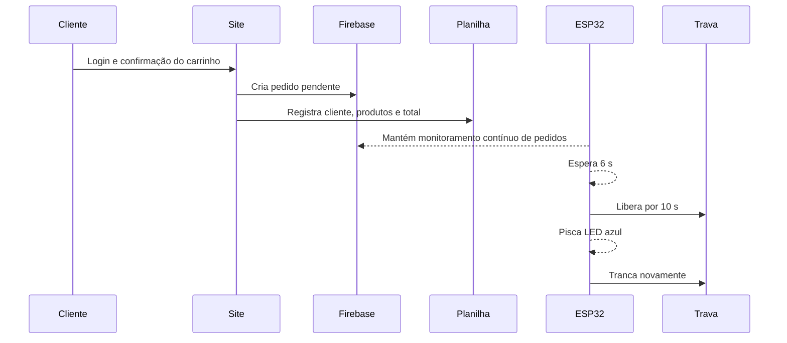

# Geladeira 14 BIS

Sistema de retirada de bebidas por QR Code: o cliente acessa o site, faz login, monta o carrinho e confirma. O pedido é salvo no Firebase e no Google Sheets; o ESP32 recebe o pedido e controla a fechadura eletromagnética.

> Estado atual: site, painel administrativo, Firebase, planilha, Apps Script e ESP32 estão configurados. A trava ainda deve ser instalada fisicamente e testada com segurança.

## Funções implementadas

- Cadastro com nome completo, usuário, telefone, CPF e senha.
- Login, botão para mostrar senha e carregamento visual.
- Catálogo responsivo por categorias: água, refrigerantes, cervejas, sucos, alimentos e outros produtos.
- Carrinho com adição, remoção, quantidades, total em reais e Pix.
- Tela verde de confirmação e sequência de abertura/trancamento.
- Registro de data, hora, cliente, itens e valor total no Google Sheets.
- Painel em [admin.html](admin.html) para habilitar, precificar, adicionar imagem por URL e remover produtos.
- Firebase Authentication, Realtime Database e regras de acesso restritas.
- ESP32 com múltiplas redes Wi-Fi, comunicação contínua com Firebase, sinal visual no LED integrado e controle do relé.

## Fluxo do pedido

## Endereços

| Item | Endereço |
| --- | --- |
| Site | [clube14bis.github.io/geladeira](https://clube14bis.github.io/geladeira/) |
| Painel administrativo | [admin.html](https://clube14bis.github.io/geladeira/admin.html) |
| Repositório | [github.com/clube14bis/geladeira](https://github.com/clube14bis/geladeira) |
| Firebase | Projeto `geladeira-14-bis` |
| Planilha | Aba `Pedidos`, título `Geladeira 14 BIS` |

## Arquivos principais

| Arquivo | Responsabilidade |
| --- | --- |
| [index.html](index.html) | Interface pública: login, cadastro, produtos, carrinho e Pix. |
| [app.js](app.js) | Firebase, autenticação, carrinho, pedido e envio ao Sheets. |
| [admin.html](admin.html) e [admin.js](admin.js) | Painel do catálogo. |

## Comunicação otimizada do ESP32

O ESP32 agora mantém um monitoramento contínuo (*stream*) da área de pedidos do Firebase. Em vez de consultar o Firebase repetidamente, ele recebe o pedido novo assim que ele é registrado. Isso reduz o uso de consultas, melhora a velocidade de resposta e torna mais confiável o acionamento da sequência da porta.

O monitoramento só é iniciado depois que a autenticação com Firebase é confirmada. Ao receber um pedido novo, o ESP32 aguarda 6 segundos, libera a porta por 10 segundos e o LED azul integrado pisca durante toda a abertura. Ao finalizar, a trava retorna ao estado fechado e o LED apaga.

O equipamento também procura automaticamente as redes Wi-Fi cadastradas e conecta à que estiver disponível.
