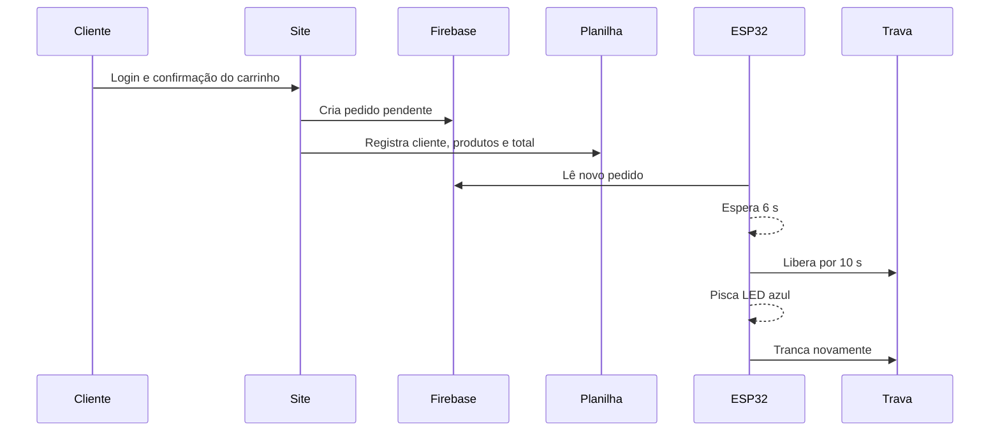

# Geladeira 14 BIS

Sistema de retirada de bebidas por QR Code: o cliente acessa o site, faz login, monta o carrinho e confirma. O pedido é salvo no Firebase e no Google Sheets; o ESP32 recebe o pedido e controla a fechadura eletromagnética.

> Estado atual: site, painel administrativo, Firebase, planilha, Apps Script e ESP32 estão configurados. A trava ainda deve ser instalada fisicamente e testada com segurança.

## Funções implementadas

- Cadastro com nome completo, usuário, telefone, CPF e senha.
- Login, botão para mostrar senha e carregamento visual.
- Catálogo responsivo por categorias: água, refrigerantes, cervejas, sucos, alimentos e outros produtos.
- Carrinho com adição, remoção, quantidades, total em reais e Pix.
- Tela verde de confirmação e sequência de abertura/trancamento.
- Registro de data, hora, cliente, itens e valor total no Google Sheets.
- Painel em [admin.html](admin.html) para habilitar, precificar, adicionar imagem por URL e remover produtos.
- Firebase Authentication, Realtime Database e regras de acesso restritas.
- ESP32 com duas redes Wi-Fi, sinal visual no LED integrado e controle do relé.

## Fluxo do pedido



## Endereços

| Item | Endereço |
| --- | --- |
| Site | [clube14bis.github.io/geladeira](https://clube14bis.github.io/geladeira/) |
| Painel administrativo | [admin.html](https://clube14bis.github.io/geladeira/admin.html) |
| Repositório | [github.com/clube14bis/geladeira](https://github.com/clube14bis/geladeira) |
| Firebase | Projeto `geladeira-14-bis` |
| Planilha | Aba `Pedidos`, título `Geladeira 14 BIS` |

## Arquivos principais

| Arquivo | Responsabilidade |
| --- | --- |
| [index.html](index.html) | Interface pública: login, cadastro, produtos, carrinho e Pix. |
| [app.js](app.js) | Firebase, autenticação, carrinho, pedido e envio ao Sheets. |
| [admin.html](admin.html) e [admin.js](admin.js) | Painel do catálogo. |
| [firebase-rules.json](firebase-rules.json) | Regras do Realtime Database. |
| [google-apps-script/Code.gs](google-apps-script/Code.gs) | Registro seguro na planilha. |
| [esp32/esp32.ino](esp32/esp32.ino) | Firmware do equipamento. |
| [esp32/secrets.example.h](esp32/secrets.example.h) | Modelo de credenciais locais. |

## Uso do site

### Cliente

1. Escaneie o QR Code e entre no site.
2. Faça login ou use **CRIAR CADASTRO**.
3. No primeiro acesso, informe nome, usuário, celular, CPF e senha.
4. Escolha os produtos. O botão **Ver carrinho** aparece depois da primeira seleção.
5. Confira quantidades, valor total e confirme.
6. A tela verde mostra o total e a chave Pix. O pedido fica registrado e o ESP32 inicia a sequência de abertura.

CPF é formatado automaticamente; telefone aceita só números; a senha tem mínimo de seis caracteres.

### Administrador

1. Abra [admin.html](admin.html) e entre com a conta administrativa cadastrada.
2. Habilite ou desabilite produtos, altere preços e salve.
3. Para novo produto, informe nome, categoria, preço e uma URL direta de imagem.
4. Use o botão de remoção para excluir produto errado.

O catálogo fica em `/catalog` no Firebase; só os itens habilitados aparecem para os clientes.

## Firebase

### Serviços

- **Authentication / E-mail e senha:** clientes e administrador.
- **Realtime Database:** perfis, catálogo, permissões e pedidos.

As regras começam fechadas. Clientes criam apenas seus próprios dados e pedidos; administrador altera catálogo; a conta técnica do ESP32 lê pedidos e registra `opened` e `locked`.

### Manutenção das regras

1. Acesse **Firebase Console → Realtime Database → Rules**.
2. Cole [firebase-rules.json](firebase-rules.json).
3. Clique em **Publicar**.

> Nunca use `.read: true` ou `.write: true` globalmente. Nunca publique `esp32/secrets.h`, senhas ou tokens; ele já está no `.gitignore`.

## Google Sheets e Apps Script

A aba `Pedidos` contém:

| Data | Hora | Nome do cliente | Bebidas | Valor total |
| --- | --- | --- | --- | --- |

O [Code.gs](google-apps-script/Code.gs) valida o token Firebase antes de gravar, evita fórmulas maliciosas, usa reais e mantém o título **Geladeira 14 BIS**.

### Reinstalar ou corrigir a integração

1. Na planilha, abra **Extensões → Apps Script**.
2. Cole [google-apps-script/Code.gs](google-apps-script/Code.gs).
3. Em **Configurações do projeto → Propriedades do script**, confirme:
   - `SPREADSHEET_ID`: ID da planilha;
   - `FIREBASE_API_KEY`: chave web do projeto, se usada.
4. Execute `autorizarIntegracaoFirebase` uma vez se o Google pedir autorização.
5. Execute `configurarPlanilha` para recriar/formatar os cabeçalhos.
6. Em **Implantar → Gerenciar implantações**, publique como **Aplicativo da web**, executando como o proprietário.
7. Coloque a URL terminada em `/exec` em `sheetsEndpoint` de [firebase-config.js](firebase-config.js).

## ESP32

### Comportamento atual

| Evento | Resultado |
| --- | --- |
| Conectou ao Wi-Fi | LED azul integrado pisca 3 vezes. |
| Conectou ao Firebase | LED azul integrado pisca 5 vezes. |
| Pedido novo | Aguarda 6 segundos. |
| Porta liberada | Relé corta a energia da trava por 10 segundos; LED azul pisca. |
| Fim do tempo | Relé volta ao normal e o LED apaga. |

O firmware tenta automaticamente as duas redes configuradas. No primeiro acesso ele ignora pedidos antigos, evitando abertura por histórico. Portanto, ligue o ESP32, espere os cinco piscas do Firebase e faça **um pedido novo**.

O LED vermelho comum dessas placas normalmente é só de energia, não é programável. O LED azul integrado costuma usar GPIO 2; isso varia conforme fabricante. GPIO 2 e GPIO 26 estão disponíveis no ESP32 DevKitC, conforme o [guia oficial da Espressif](https://documentation.espressif.com/esp-dev-kits/en/latest/esp32/esp32-devkitc/user_guide.html).

### Regravar o ESP32

1. Instale o [Arduino IDE 2](https://www.arduino.cc/en/software/).
2. Em **Settings/Preferences → Additional Boards Manager URLs**, adicione:

   `https://espressif.github.io/arduino-esp32/package_esp32_index.json`

3. Em **Boards Manager**, instale **esp32 by Espressif Systems**.
4. Em **Library Manager**, instale `FirebaseClient` e `ArduinoJson`.
5. Abra [esp32/esp32.ino](esp32/esp32.ino).
6. Copie [esp32/secrets.example.h](esp32/secrets.example.h) como `secrets.h` na mesma pasta e complete as credenciais privadas.
7. Escolha **Tools → Board → ESP32 Arduino → ESP32 Dev Module**.
8. Conecte o cabo USB de dados e selecione **Tools → Port**.
9. Clique em **Upload**. Se ficar em `Connecting...`, mantenha **BOOT** pressionado até o envio começar.
10. Abra **Tools → Serial Monitor** em **115200 baud** para ver status e erros.

## Instalação física na geladeira

### O que comprar

| Item | Especificação / referência | Qtde. | Observação |
| --- | --- | ---: | --- |
| Trava | Fechadura eletroímã **12 Vcc, 60 kg / 180 lb**, com suporte L/Z compatível | 1 | Escolha pelo tamanho e material da porta. Confirme se é *fail-safe*: sem energia ela abre. |
| Relé | Módulo 1 canal, 5 V, optoacoplado, entrada compatível com **3,3 V**, COM/NC/NO, com **Songle SRD-05VDC-SL-C** ou equivalente | 1 | O relé Songle é de 5 V; os contatos têm capacidade de até 7 A em 28 Vcc para carga resistiva. Confira o módulo antes da compra. [Datasheet](https://www.handsontec.com/dataspecs/relay/SRD-05VDC-SL-C.pdf) |
| Fonte da trava | Fonte certificada **12 Vcc, mínimo 2 A** | 1 | Referência industrial: Mean Well **HDR-30-12** (12 V / 2 A). A fonte deve superar a corrente nominal da trava. [Especificação](https://www.meanwell.com/Upload/PDF/HDR-30/HDR-30-SPEC.PDF) |
| Conversor | Buck **LM2596**, entrada 7–35 V, saída ajustável em 5 V, mínimo 2 A | 1 | Ajuste em **5,0 V antes** de ligar ESP32/relé. |
| Proteção | Porta-fusível e fusível 1 A, ou conforme corrente da trava | 1 | Instale no positivo de 12 V. |
| Instalação | Caixa isolante, bornes, cabo 0,5–0,75 mm², prensa-cabos e abraçadeiras | — | Mantenha tudo fora de condensação e umidade. |

> Não compre somente pela força anunciada. Confira dimensões, suporte mecânico, polaridade, corrente e se a trava cabe na porta. Se ela consumir mais de 2 A, aumente fonte e fusível conforme o manual do fabricante.

### Ligações

```text
REDE AC (127/220 V)
        │
        └── Fonte 12 Vcc certificada ──────────────────────────────────────┐
              +12 V ── fusível ── COM do relé                              │
                                     NC ─────────── + da trava eletromã    │
              GND  ──────────────────────────────── - da trava eletromã   │
                                                                            │
              +12 V/GND ── entrada do buck LM2596                          │
                         buck ajustado em 5,0 V                             │
                         OUT+ ── 5V/VIN do ESP32 e VCC do relé             │
                         OUT- ── GND ESP32 e GND do relé ──────────────────┘

ESP32 GPIO 26 ─────────────────────────── IN do módulo relé
```

Use **NC** no relé:

- relé inativo → COM ligado ao NC → trava recebe 12 V → porta travada;
- ESP32 ativa relé → COM sai do NC → corta 12 V → porta liberada;
- após 10 segundos → volta ao NC → trava energiza e tranca.

O firmware atual considera relé **ativo em nível baixo**: GPIO 26 em `HIGH` mantém travada e `LOW` libera. Se seu relé operar ao contrário, ajuste `RELE_TRAVADO` e `RELE_DESTRAVADO` em [esp32/esp32.ino](esp32/esp32.ino) **antes** de conectar a trava.

### Ordem segura de instalação

1. Não conecte a trava inicialmente; ligue somente ESP32 e relé.
2. Alimente o ESP32 por USB e confirme 3 piscas de Wi‑Fi e 5 de Firebase.
3. Ligue VCC/GND do relé à saída de 5 V do buck; ligue GPIO 26 ao IN.
4. Faça pedido novo. Após 6 segundos, confirme que o LED do relé muda por 10 segundos.
5. Com multímetro, confirme que COM–NC abre somente durante esses 10 segundos.
6. Desligue as fontes, instale fusível, trava e alimentação de 12 V.
7. Teste com a porta aberta. Só depois faça o teste de retenção com a porta fechada.
8. Fixe fonte, relé, buck e conexões em caixa isolante externa.

## Segurança

- **Nunca ligue 12 V, trava ou bobina do relé diretamente a um GPIO.**
- GPIO do ESP32 é 3,3 V e serve somente como sinal.
- Não trabalhe na rede 127/220 V sem qualificação; use fonte AC/DC pronta e certificada.
- Travas eletromagnéticas *fail-safe* abrem quando falta energia. Mantenha abertura de emergência.
- Não instale eletrônica onde haja condensação, calor excessivo ou partes móveis.

## Teste completo

1. Ligue ESP32 e espere os padrões 3 + 5 piscas.
2. Faça um pedido novo no site.
3. Confirme a nova linha no Sheets.
4. Depois de cerca de 6 segundos, veja o LED azul piscar por 10 segundos.
5. No Serial Monitor, confira `Novo pedido`, `GELADEIRA ABERTA` e `GELADEIRA TRANCADA`.
6. Com relé instalado, confirme clique e mudança COM–NC.
7. Só então conecte a trava.

## Solução de problemas

| Sintoma | Verificação |
| --- | --- |
| LED não pisca 3 vezes | Wi-Fi/senha incorretos ou rede não é 2,4 GHz. Confira `secrets.h`. |
| Pisca 3, mas não 5 | Wi‑Fi funciona; Firebase não autenticou. Confira credenciais técnicas e regras. |
| Pedido não aciona ESP32 | Espere a sincronização e faça pedido **novo**; verifique Serial Monitor e Firebase. |
| Pedido não aparece no Sheets | Revise implantação `/exec`, `SPREADSHEET_ID` e execute `autorizarIntegracaoFirebase`. |
| Relé invertido | Teste COM/NC/NO com multímetro e ajuste níveis no firmware. |
| ESP32 reinicia com relé | Use fonte/buck adequados, GND comum e mantenha cabos da trava afastados dos sinais. |

## Publicação

O site é publicado da branch `main` pelo GitHub Pages. Após alterar arquivos, faça commit, aguarde alguns minutos e atualize o navegador. O projeto usa versão de arquivos e cabeçalhos para reduzir cache.
